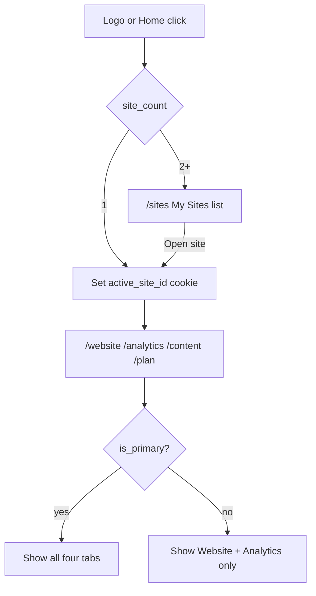
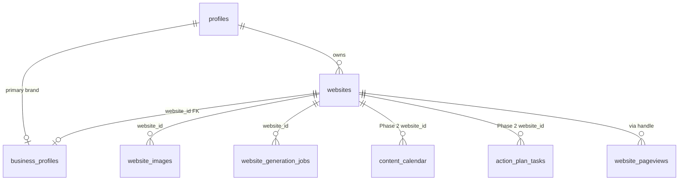

# ZURI — MULTI-SITE SUPPORT
# Deferred product specification: many websites per account, My Sites, Add Site,
# plan limits, tab scoping, and downgrade locking.
#
# STATUS: DEFERRED — do not implement or merge multi-site runtime code during
# the competition window. This document is the authoritative design for the
# post-competition build. Redirect engineering time to the trial system, the
# custom-sites funnel, the editor link/embed session, then 5B.

---

## 0. STATUS & SCOPE

| Item | Value |
|------|--------|
| Status | **DEFERRED** (Option C — post-competition) |
| This cycle deliverable | This reference doc only |
| Schema / API / UI | **Do not touch** until a dedicated multi-site implementation session |
| Canonical table | Evolve existing `websites` (no parallel `sites` table) |

When implementation begins, read this doc in full, then cross-check current
code against §11 (current-state inventory). The live app is still strictly
one website per user.

---

## 1. LOCKED PRODUCT DECISIONS

| Decision | Choice |
|----------|--------|
| Table model | Evolve `websites` — drop `UNIQUE(user_id)`, add multi-site columns |
| Selected site | HttpOnly cookie `zuri_active_site_id` + `profiles.active_site_id` fallback |
| Site limits | Free = 1, Pro = 1, Growth = 3, Premium = 6 |
| Logo / Home | If account has **exactly 1** site → go straight into that site's workspace (no list-of-one). If **2+** sites → `/sites` (My Sites). |
| Primary site tabs | Website, Content, Analytics, Plan (full access) |
| Non-primary tabs | Website + Analytics only — hide Content and Plan; reject/redirect those routes |
| Downgrade lock order | Keep primary + oldest sites unlocked up to the new limit; lock newest-created first; unpublish if live; unlock on upgrade without auto-republish |
| Secondary site profile | Freeform brief on `websites` (`site_kind = 'freeform'`) — not a second `business_profiles` row |
| Shipping | Post-competition |

### 1.1 Single-site logo shortcut (required)

During (and after) competition, nearly every account has one site. Forcing a
"My Sites" list-of-one is friction. Spec behavior:

1. Resolve the account's non-deleted site count.
2. If `count === 1`: set active site to that row, navigate to `/dashboard` (or `/website` if dashboard is retired later). Do **not** render My Sites.
3. If `count >= 2`: navigate to `/sites`.
4. While inside a multi-site workspace (`count >= 2`), the logo / Home affordance returns to `/sites` so the user can switch without hunting through settings. Prefer client navigation (no full reload) when already in the app shell.

---

## 2. WHY THE BLAST RADIUS IS LARGE

Implementers should treat this as a core data-model migration, not a page add.

| Constraint / pattern | Where | Implication |
|----------------------|--------|-------------|
| `websites.user_id UNIQUE` | `003_business_content.sql`, `20260714_website_builder_foundation.sql` | Must drop before multi-row inserts |
| `business_profiles.user_id UNIQUE` | `003_business_content.sql` | Keep for v1 (primary-only brand); secondary sites use freeform brief |
| `.eq("user_id").maybeSingle()` | Website / Analytics pages + most `/api/website/*` routes | Every call site must resolve active `website_id` |
| Content + Plan user-scoped | `content_*`, `action_plan_tasks`, `user_progress` | Phase 2: add `website_id`, primary-only gates |
| `limits.websites` unused | `src/lib/payments/plans.ts` | Premium currently `3`, Growth `1` — update + enforce |
| Generation upsert `onConflict: "user_id"` | `src/lib/website/generation-pipeline.ts` | Must become insert / conflict on site id or `(user_id, handle)` |
| Downgrades flip `subscriptions` only | `trials.ts`, `handle-failed-payment.ts`, `activate-subscription.ts` | No site lock/unpublish side effects today |
| No freeform generation path | Onboarding → `BusinessProfile` only | Add Site needs a distinct prompt path |

Analytics are already mostly keyed by `website_handle` (+ `website_owner_id`), so they are closer to multi-site-ready once handles are unique per site.

---

## 3. TARGET ARCHITECTURE



### 3.1 Entity model (target)



---

## 4. PLAN LIMITS

Update both `src/lib/payments/plans.ts` (`PLAN_CONFIG`) and `plans.limits`
JSONB in the database:

| Plan | `limits.websites` | Meaning |
|------|-------------------|---------|
| Free | 1 | One preview site; publish still gated by `can_publish` |
| Pro | 1 | One site (the primary) |
| Growth | 3 | 1 primary + 2 additional |
| Premium | 6 | 1 primary + 5 additional |

**Enforcement:** server-side on site creation (and any regenerate-as-create path).
Count non-deleted websites for the user; if `count >= limit`, return 403 with
upgrade hint. UI at the limit shows `UpgradePrompt` (`src/components/ui/UpgradePrompt.tsx`)
— never a mute disabled button with no explanation.

`limits.websites` is defined today but **never counted or enforced**. Premium's
current `3` must become `6`; Growth's `1` must become `3`.

---

## 5. PHASE 1 — Schema, selection, My Sites, Add Site, limits

Ship Phase 1 as a self-contained branch that can be QA'd before Phase 2.
Phase 1 does **not** need Content/Plan `website_id` yet, but all Website +
Analytics routes must be site-scoped.

### 5.1 Schema migration (evolve `websites`)

**DDL sketch (illustrative — write the real migration when implementing):**

```sql
-- Drop one-site-per-user constraint
ALTER TABLE websites DROP CONSTRAINT IF EXISTS websites_user_id_key;
-- Keep a non-unique index for ownership lookups
CREATE INDEX IF NOT EXISTS idx_websites_user_id ON websites(user_id);

ALTER TABLE websites
  ADD COLUMN IF NOT EXISTS name text,
  ADD COLUMN IF NOT EXISTS is_primary boolean NOT NULL DEFAULT false,
  ADD COLUMN IF NOT EXISTS is_locked boolean NOT NULL DEFAULT false,
  ADD COLUMN IF NOT EXISTS locked_at timestamptz,
  ADD COLUMN IF NOT EXISTS site_kind text NOT NULL DEFAULT 'business'
    CHECK (site_kind IN ('business', 'freeform')),
  ADD COLUMN IF NOT EXISTS freeform_brief jsonb NOT NULL DEFAULT '{}'::jsonb,
  ADD COLUMN IF NOT EXISTS thumbnail_url text;

-- Exactly one primary per user
CREATE UNIQUE INDEX IF NOT EXISTS websites_one_primary_per_user
  ON websites (user_id) WHERE is_primary = true;

-- Public slug authority
CREATE UNIQUE INDEX IF NOT EXISTS websites_handle_unique
  ON websites (handle) WHERE status IS DISTINCT FROM 'deleted';

-- profiles.active_site_id for durable preference
ALTER TABLE profiles
  ADD COLUMN IF NOT EXISTS active_site_id uuid REFERENCES websites(id) ON DELETE SET NULL;

-- business_profiles → primary website (still one brand row per user in v1)
ALTER TABLE business_profiles
  ADD COLUMN IF NOT EXISTS website_id uuid REFERENCES websites(id) ON DELETE SET NULL;

-- website_images / website_generation_jobs
ALTER TABLE website_images
  ADD COLUMN IF NOT EXISTS website_id uuid REFERENCES websites(id) ON DELETE CASCADE;
ALTER TABLE website_generation_jobs
  ADD COLUMN IF NOT EXISTS website_id uuid REFERENCES websites(id) ON DELETE SET NULL;
```

**Backfill (must be lossless):**

1. For every existing `websites` row: `is_primary = true`, `site_kind = 'business'`,
   `name = COALESCE(business_profiles.business_name, websites.handle)`.
2. Set `business_profiles.website_id` to that user's primary website.
3. Backfill `website_images.website_id` and `website_generation_jobs.website_id`
   to the user's primary website where null.
4. Set `profiles.active_site_id` to the primary website.
5. Sync: ensure `websites.handle` matches `profiles.handle` for primary rows
   where safe (document any historical divergence; prefer websites.handle as
   serve source of truth going forward).

**RLS:** Keep ownership as `auth.uid() = user_id`. Rename singular policy
labels ("Users manage own website") to plural wording. Published public
SELECT policy stays on `status = 'published'`.

**Phase 1 leaves Content/Plan tables user-scoped.** Phase 2 adds `website_id`.

**Analytics:** remain handle-keyed (`website_pageviews`, `website_events`,
`website_analytics_daily`). Once `websites.handle` is unique, multi-site
queries filter by the active site's handle.

### 5.2 Active site resolution

New helper: `src/lib/sites/active-site.ts` (name flexible).

Resolution order:

1. HttpOnly cookie `zuri_active_site_id`
2. Validate: row exists, `user_id` matches, `status != 'deleted'`
3. Else `profiles.active_site_id` (same validation)
4. Else primary site (`is_primary = true`)
5. Persist cookie (and optionally profile) so subsequent requests are stable

Also expose:

- `POST /api/sites/select` — body `{ websiteId }` → set cookie + `profiles.active_site_id`
- `GET /api/sites` — list sites for My Sites UI

**Locked sites:** readable for preview; all mutating website APIs return 403
with an upgrade hint (`upgradeRequired` + message). Publish must refuse locked sites.

**Replace every** `.from("websites").eq("user_id", …).maybeSingle()` in
Website/Analytics paths with resolution via active site (or explicit
`websiteId` that is ownership-checked).

Generation pipeline: stop upserting `onConflict: "user_id"`. Insert new rows
for Add Site; update by `websites.id` for regenerations of an existing site.

### 5.3 My Sites page + nav

**Route:** `src/app/(app)/sites/page.tsx` (and supporting components under
`src/components/app/sites/` as needed).

**List each site:**

| Field | Source |
|-------|--------|
| Name | `websites.name` |
| Handle | `websites.handle` |
| Thumbnail | `thumbnail_url` or derived preview |
| Status | published / preview (unpublished) / locked |
| Actions | Open; if locked → "Upgrade to unlock" |

**Add Site CTA** lives on this page only (not scattered elsewhere), gated by
plan limit (§4).

**Nav / logo:**

- Update `src/components/app/nav-config.ts`, `sidebar.tsx`, `bottom-tabs.tsx`,
  command palette, and logo click handlers for the §1.1 shortcut rules.
- Home entry semantics: single-site → workspace; multi-site → My Sites.

### 5.4 Lightweight Add Site flow

**Route:** `/sites/new` — distinct from `/start` business onboarding. Do **not**
trim-copy the 11-step business questionnaire.

| Step | Collects | UI reuse |
|------|----------|----------|
| 1. Site name / purpose | Free text ("What's this site for?"), handle via `HandleInput` | Onboarding input tokens, `HandleInput` |
| 2. Template / style | Cards: Event, Product launch, Portfolio/personal, Simple landing → map to archetypes | `SelectionCard` interaction pattern only; new copy |
| 3. Key content | Headline, short description, one CTA; optional date/location if Event-style | Same shell / continue gleam |

**Visual consistency:** reuse `.onboarding-shell`, `.onboarding-headline`,
`.btn-gold` / continue gleam, premium loader / `ZuriSpinner` patterns from
onboarding and custom-site — not the business question set.

**On completion:**

1. Enforce plan site limit server-side.
2. Insert `websites` with `is_primary = false`, `site_kind = 'freeform'`,
   `freeform_brief = { purpose, headline, description, cta, date?, location? }`,
   `name`, `handle`.
3. Enqueue generation job scoped to this website id.
4. Run a **distinct freeform prompt path** in `generation-pipeline.ts` /
   `generate-website` — do not coerce sparse freeform fields through the
   full `BusinessProfile` business template (that produces poor output).
5. Set active site cookie → open Website studio for the new site.

**Style → archetype mapping (v1 suggestion):**

| Card | Archetype |
|------|-----------|
| Event | `community-vibrant` |
| Product launch | `editorial-bold` or `clean-modern` |
| Portfolio / personal | `portfolio-dramatic` |
| Simple landing page | `authority-minimal` or `clean-modern` |

Tune mapping during implementation if template coverage suggests better fits.

### 5.5 Phase 1 checklist

- [ ] Migration + lossless backfill for existing single-site accounts
- [ ] `PLAN_CONFIG` + DB `plans.limits.websites` updated (1 / 1 / 3 / 6)
- [ ] Active site cookie + helper; Website/Analytics APIs site-scoped
- [ ] My Sites list + Add Site CTA with `UpgradePrompt` at limit
- [ ] Logo shortcut: 1 site → workspace; 2+ → My Sites
- [ ] Add Site freeform E2E + distinct generation path
- [ ] Server rejects create beyond plan limit
- [ ] Locked site mutations blocked (even if Phase 2 locking isn't fully wired yet, support the `is_locked` column)

---

## 6. PHASE 2 — Tab scoping, content/plan site_id, downgrade locking

### 6.1 Tab visibility + Content / Plan gates

| Site type | Website | Content | Analytics | Plan |
|-----------|---------|---------|-----------|------|
| Primary (`is_primary`) | Yes | Yes | Yes | Yes |
| Non-primary | Yes | **No** | Yes | **No** |

**Nav:** filter `WORKSPACE_NAV` (and mobile bottom tabs / command palette) so
Content and Plan are omitted when `!activeSite.is_primary`.

**Routes:** `/content`, `/content/*`, `/plan` — if active site is non-primary,
redirect to `/website` (pages) or return 403 (APIs). Do not silently render
empty calendars.

**Schema (Phase 2):**

- Add `website_id` to `content_pillars`, `content_calendar`, `generated_content`,
  `action_plan_tasks` (and related content intelligence tables as needed).
- Backfill all existing rows to the user's primary `website_id`.
- Content generation that today loads "the" website/business profile must load
  the **primary** site's brand context (or refuse when active site is non-primary).

**Analytics:** always filter by active site handle/id — no cross-site leakage
in dashboards or `/api/analytics/*`.

**Account-level features** (Agency Marketplace, Settings, billing, notifications)
stay account-scoped, not site-scoped.

### 6.2 Downgrade / upgrade site locking

New helper: `reconcileSiteLocks(userId, planId)` (e.g. under `src/lib/sites/`).

**Algorithm (v1 — automatic, no user choice):**

1. Load non-deleted sites for the user.
2. Sort: primary first, then `created_at ASC` (oldest next).
3. Let `limit = PLAN_CONFIG[planId].limits.websites`.
4. Unlock the first `limit` sites in that order; lock the remainder
   (equivalently: among overflow, newest-created lock first).
5. **On lock:** set `is_locked = true`, `locked_at = now()`; if
   `status === 'published'`, unpublish to `preview` (clear live serve). Do not
   delete data. Do not strip rows.
6. **On unlock** (re-upgrade / higher limit): set `is_locked = false`,
   clear `locked_at`; **do not** auto-republish — republish is an explicit user action.

**Call from:**

- `processExpiredTrials` (`src/lib/payments/trials.ts`)
- `processExpiredGracePeriods` (`src/lib/payments/handle-failed-payment.ts`)
- `activateSubscription` (`src/lib/payments/activate-subscription.ts`) — unlock within new limit
- Any future voluntary plan-change path

**My Sites UI:** locked badge + "Upgrade to unlock" CTA (billing / upgrade sheet).

**Assumption to state in the PR / session notes when shipping:**

> When a downgrade reduces the site limit below current site count, we lock
> the most recently created sites first, keeping the primary and oldest sites
> active up to the new limit. There is no user-facing "choose which sites to
> keep" step in v1 — that is a candidate for a future session if precision
> matters more than speed.

**Note on `suspended`:** serve routes already handle `status === 'suspended'`.
v1 locking for plan limits uses `is_locked` + unpublish to `preview` per product
requirements (preview-only, not a separate suspended public page). Do not
conflate payment-suspend scaffolding with plan-limit locking unless product
later unifies them.

### 6.3 Phase 2 checklist

- [ ] Content + Plan hidden for non-primary; routes/APIs reject
- [ ] `website_id` on content/plan tables + primary backfill
- [ ] `reconcileSiteLocks` wired into trial/grace/activate paths
- [ ] Downgrade: correct sites locked, published ones unpublished
- [ ] Upgrade: unlock without auto-republish
- [ ] My Sites shows locked state + upgrade CTA
- [ ] No cross-site data leakage across Website / Content / Analytics / Plan
- [ ] TypeScript: zero errors

---

## 7. SUCCESS CRITERIA (FULL FEATURE)

Copied from the session brief — required before merging the multi-site branch:

1. Existing single-site accounts migrate with zero data loss; current site
   becomes primary (`is_primary = true`) with all data correctly linked.
2. Creating a site beyond the plan's limit is rejected server-side.
3. My Sites lists all sites with accurate status; logo skips list when `count === 1`.
4. Non-primary sites show only Website + Analytics; Content routes reject.
5. Lightweight Add Site completes E2E with its own question set, reused styling,
   non-primary row, and freeform generation path.
6. Downgrade locks newest-first, unpublishes live overflow sites, keeps data;
   upgrade unlocks without auto-republish.
7. All four tabs operate on the currently selected site with no cross-site leakage.
8. TypeScript: zero errors.

---

## 8. ADD SITE — COPY GUIDELINES

Tone: open-ended and purpose-agnostic. Avoid business-onboarding language.

| Avoid | Prefer |
|-------|--------|
| "What's your business?" | "What's this site for?" |
| "Who are your customers?" | (omit — not in this flow) |
| "Services / offerings" | Headline + short description + CTA |
| Brand-vibe business adjectives only | Style directions: Event, Product launch, Portfolio, Simple landing |

Keep step count small (three steps + building/loader). Reuse premium motion
and tokens so the flow feels like the same product family as `/start`.

---

## 9. KEY FILE TOUCH LIST (WHEN IMPLEMENTING)

### Schema & types

- New migration under `supabase/migrations/`
- `src/types/website.ts`, `src/types/database.ts`, `src/types/brand.ts` as needed

### Site selection & limits

- `src/lib/sites/active-site.ts` (new)
- `src/lib/sites/reconcile-locks.ts` (new, Phase 2)
- `src/lib/payments/plans.ts` — website counts
- `src/lib/payments/feature-gate.ts` — optional `checkWebsiteLimit`
- `src/lib/payments/activate-subscription.ts`, `trials.ts`, `handle-failed-payment.ts`

### APIs / pages

- `src/app/(app)/sites/page.tsx`, `src/app/(app)/sites/new/...` (new)
- `src/app/api/sites/*` (new)
- All `src/app/api/website/*` + website/analytics app pages
- Content APIs + `src/app/(app)/content/*`, `src/app/(app)/plan/*` (Phase 2)
- `src/lib/website/generation-pipeline.ts`, `src/app/api/ai/generate-website/route.ts`

### Nav / upgrade UI

- `src/components/app/nav-config.ts`, `sidebar.tsx`, `bottom-tabs.tsx`,
  `command-palette.tsx`, logo click
- `src/components/ui/UpgradePrompt.tsx` (wire at Add Site limit)
- Reuse: `HandleInput`, `SelectionCard`, onboarding CSS tokens / loaders

### Handle uniqueness

- `src/app/api/handle/check/route.ts` — already checks profiles + websites;
  ensure unique index on `websites.handle` and keep primary `profiles.handle` in sync on primary handle changes (`src/app/api/handle/update/route.ts` currently updates profiles only — fix during implementation).

---

## 10. OPEN FOLLOW-UPS (OUT OF V1 SCOPE)

| Item | Notes |
|------|--------|
| "Choose which sites to keep" on downgrade | v1 is newest-first automatic; add picker later if needed |
| Meta / Search Console per site | Today `meta_connections` / `search_console_connections` are `user_id UNIQUE` — remain account-level unless product splits them |
| Multiple `business_profiles` per account | v1 keeps one brand profile (primary); freeform sites use `freeform_brief` |
| Custom domain count limits | Domains stay per-website row; Growth+ gate on add remains; decide later if domains count toward a separate quota |
| Cancel-at-period-end → Free cron | Billing gap today; when fixed, call `reconcileSiteLocks` |
| Dashboard multi-site summary | Optional later; v1 Home shortcut + My Sites is enough |
| Thumbnail generation | May start null; populate from OG/preview snapshot in a follow-up |

---

## 11. CURRENT-STATE INVENTORY (AS OF DEFERRAL)

Snapshot for implementers — re-verify before coding; this is not a substitute
for reading the migrations and call sites.

| Area | Current behavior |
|------|------------------|
| `websites` | One row per user (`user_id UNIQUE`) |
| `business_profiles` | One row per user (`user_id UNIQUE`) |
| Workspace load | `.eq("user_id").maybeSingle()` everywhere |
| Nav tabs | Static `WORKSPACE_NAV` — always show all four |
| Site switcher | None |
| `limits.websites` | Free/Pro/Growth = 1, Premium = 3; **unenforced** |
| Publish/unpublish | Optional `websiteId` body but still user-scoped single row |
| Generation | Upsert on `user_id`; business profile only |
| Downgrade | Updates `subscriptions` only; sites stay published |
| `UpgradePrompt` | Component exists; not currently consumed |
| Handle check | RPC / profiles + websites select |

---

## 12. IMPLEMENTATION SESSION GUIDANCE

1. **Do not start** until competition-critical work (trials, custom-sites funnel,
   editor link/embed, 5B) is done or explicitly deprioritized.
2. Build on a **dedicated branch**; migrate staging data and run the §7
   regression checklist before merge.
3. Prefer **Phase 1 merge** only if Phase 2 cannot land in the same window —
   but never ship Phase 1 without site-scoped Website/Analytics (partial
   migration that still uses `maybeSingle()` by user is worse than deferring).
4. If time is still tight at implementation time: ship Phase 1 + Content/Plan
   route rejects (even before full `website_id` backfill), then Phase 2 locking
   in a fast follow — still avoid merging a half-migrated data model.

---

## 13. RELATED DOCS

- `docs/02_WEBSITE_BUILDER.md` — generation, publish, serve
- `docs/01_ONBOARDING_V2.md` — primary-site business onboarding (do not reuse as Add Site)
- `docs/06_MONETIZATION.md` — plan matrix (update website counts when implementing)
- `docs/05_ANALYTICS.md` — handle-keyed analytics
- `docs/10_SECURITY.md` — RLS patterns to extend for multi-row `websites`
)
